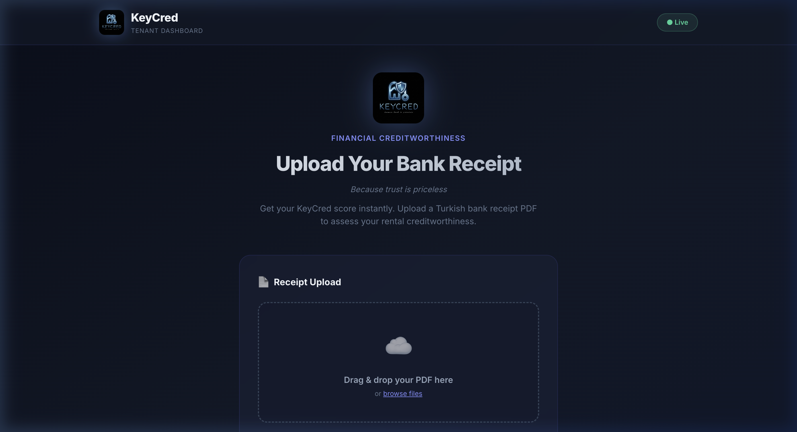

<p align="center">
  
</p>

<h3 align="center"><em>Because trust is priceless</em></h3>

<p align="center">
  
  
  
  
  
</p>

---

## 🏠 About

**KeyCred** is a fintech rental ecosystem MVP that assesses tenant creditworthiness by analyzing Turkish bank receipt PDFs. Tenants upload their bank receipts through a modern dashboard, and the system returns a **KeyCred Score** along with a **maximum rent limit** recommendation.

<p align="center">
  
</p>

---

## ⚙️ Tech Stack

| Layer | Technology |
|-------|-----------|
| **Backend** | Python · FastAPI · SQLAlchemy · SQLite · pdfplumber |
| **Frontend** | React 19 · Vite · Tailwind CSS v4 |
| **API** | REST · CORS enabled · File upload via `multipart/form-data` |

---

## 📁 Project Structure

```
keycred-mvp/
├── backend/
│   ├── main.py          # FastAPI app, CORS, endpoints
│   ├── database.py      # SQLAlchemy engine & session
│   ├── models.py        # Tenant, BankReceipt, Score models
│   ├── services.py      # RuleBasedScorer (mock PDF parser)
│   └── uploads/         # Uploaded PDF storage
├── frontend/
│   ├── public/
│   │   └── keycred-logo.png
│   ├── src/
│   │   ├── App.jsx      # Dashboard UI (upload + score card)
│   │   ├── main.jsx     # React entry point
│   │   └── index.css    # Tailwind + dark theme
│   ├── index.html
│   └── vite.config.js
└── assets/
    ├── keycred-banner.jpg
    └── dashboard-screenshot.png
```

---

## 🚀 Getting Started

### Prerequisites

- Python 3.12+
- Node.js 18+

### Backend

```bash
cd backend
pip install fastapi uvicorn sqlalchemy python-multipart pdfplumber
uvicorn main:app --reload --port 8000
```

The API will be available at `http://localhost:8000` (Swagger docs at `/docs`).

### Frontend

```bash
cd frontend
npm install
npm run dev
```

The dashboard will be available at `http://localhost:5173`.

---

## 🔌 API

### `POST /api/upload-receipt/{tenant_id}`

Upload a bank receipt PDF and receive a creditworthiness score.

**Request:** `multipart/form-data` with a `file` field (PDF)

**Response:**
```json
{
  "tenant_id": 1,
  "receipt_id": 1,
  "keycred_score": 802,
  "max_rent_limit": 26700.0,
  "pages_parsed": 1,
  "status": "completed"
}
```

---

## 🎯 Features

- 🏗️ **Drag & Drop PDF Upload** — Intuitive file upload with visual feedback
- 📊 **Animated Score Ring** — SVG-based gauge with color-coded scoring
- 🌙 **Dark Glassmorphism UI** — Premium dark theme with blur effects
- 🔄 **Real-time Processing** — Instant score calculation after upload
- 💾 **Persistent Storage** — SQLite database for tenants, receipts, and scores

---

## 📄 License

This project is for demonstration and competition purposes.

---

<p align="center">
  <strong>KeyCred</strong> · Built with ❤️
</p>
